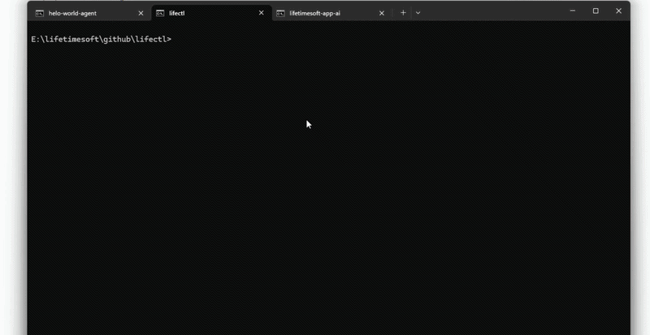

# @lifetimesoft/agent-sdk

Lightweight SDK for building portable AI agents that run on the LifetimeSoft platform.

---

## 🚀 Overview

`@lifetimesoft/agent-sdk` is a minimal runtime SDK that helps developers build **AI agents** with a consistent interface and lifecycle.

It provides:

* A standard `defineAgent()` API
* Typed `ctx` (context) object
* Abstraction for AI, storage, logging, and more
* Compatibility with `lifectl` CLI runtime

---

## 🧠 Philosophy

* **Portable** → Agent runs anywhere (local, SaaS, server)
* **Simple** → Write only business logic
* **Decoupled** → No direct dependency on SaaS APIs
* **Extensible** → Future-ready for plugins, workflows, etc.

---

## 📦 Installation

```bash
npm install @lifetimesoft/agent-sdk
```

---

## ✨ Quick Example

```ts
import { defineAgent } from "@lifetimesoft/agent-sdk"

export default defineAgent<{ text: string }, { reply: string }>({
  async run(ctx) {
    const reply = await ctx.ai.chat({
      messages: [{ role: "user", content: `Say hello to: ${ctx.input.text}` }],
    })

    ctx.log.info("AI reply:", reply)

    return { reply }
  },
})
```

> Running an agent built with this SDK via `lifectl`:



---

## ⚙️ Context (ctx)

The `ctx` object is injected by the runtime (via `lifectl`) and provides everything your agent needs.

### Structure

```ts
type Context = {
  input: unknown

  config: {
    agent: string
    version: string
    scheduler?: SchedulerConfig
    [key: string]: unknown
  }

  env: Record<string, string>

  ai: {
    chat: (req: {
      messages: Array<{ role: "system" | "user" | "assistant"; content: string }>
      model?: string
      temperature?: number
    }) => Promise<string>
  }

  storage: {
    get: <T>(key: string) => Promise<T | null>
    set: <T>(key: string, value: T, opts?: { ttl?: number }) => Promise<void>
    delete: (key: string) => Promise<void>
  }

  queue: {
    push: <T>(data: T) => Promise<void>
  }

  log: {
    info: (...args: unknown[]) => void
    error: (...args: unknown[]) => void
    debug: (...args: unknown[]) => void
  }

  meta: {
    job_id?: string
    run_id: string
    timestamp: number
  }
}
```

---

## 🔧 API

### `defineAgent()`

Wrap your agent definition.
You can pass generic types for input and output: `defineAgent<TInput, TOutput>({...})`.

```ts
defineAgent({
  // Optional: schema for validating input before run() is called
  inputSchema: { /* your schema */ },

  // Optional: schema for validating agent config before run() is called
  configSchema: { /* your schema */ },

  async run(ctx) {
    // your logic here
  },
})
```

---

## 🧪 Example: Using Input + Config

```ts
export default defineAgent({
  async run(ctx) {
    const { input, config } = ctx
    const tone = (config.tone as string) ?? "neutral"

    const reply = await ctx.ai.chat({
      messages: [
        { role: "system", content: `You reply in a ${tone} tone.` },
        { role: "user", content: (input as { text: string }).text },
      ],
    })

    return { text: reply }
  },
})
```

---

## 🧪 Testing

Use `createMockContext()` from `@lifetimesoft/agent-sdk/testing` to test agents locally without the `lifectl` runtime.

```ts
import { createMockContext } from "@lifetimesoft/agent-sdk/testing"
import myAgent from "./my-agent"

const ctx = createMockContext({
  input: { text: "hello" },
  ai: {
    chat: async () => "mocked AI response",
  },
})

const result = await myAgent.run(ctx)
console.log(result)
```

The mock context also exposes inspection helpers:

```ts
// Inspect storage state after run
const store = ctx.storage._getStore()

// Inspect all messages pushed to the queue
const messages = ctx.queue._getMessages()
```

---

## 🗂️ Best Practices

### ✅ Do

* Use `ctx.ai` instead of calling external APIs directly
* Use `ctx.log` for logging
* Keep agent logic simple and focused
* Treat `ctx` as your only runtime interface

---

### ❌ Don't

* Call SaaS APIs directly (`fetch(...)`)
* Implement your own heartbeat or polling
* Store sensitive logic outside `ctx.env`

---

## 🔄 Lifecycle (Handled by Runtime)

The SDK is designed to work with the `lifectl` CLI, which automatically manages:

* **WebSocket heartbeat** — persistent connection to SaaS, hibernates between messages (no polling overhead)
* **Offline detection** — immediate when connection drops, no polling delay
* **Scheduler loop** — runs `run()` on schedule, restartable without process restart
* **Config hot-reload** — when scheduler config changes in the dashboard, the runtime receives a `config_updated` message and restarts the scheduler loop automatically — no agent restart needed
* **Manual trigger** — when scheduler is `none`, the runtime listens for `trigger` messages and calls `run()` on demand
* Error handling
* Retry logic with automatic WebSocket reconnect

👉 You only implement `run(ctx)`

---

## 🕐 Scheduler

The scheduler is **fully managed by the platform** — agents never configure it directly.

The platform reads the scheduler config from the database and injects it into `ctx.config.scheduler`. The runtime then handles the loop automatically before calling `run()`.

### Scheduler Config Format

```ts
type SchedulerConfig =
  | { type: "none" }
  | { type: "interval"; value: number }   // value = milliseconds
  | { type: "cron";     value: string }   // value = cron expression (5 fields)
```

### Behavior

| type | behavior |
|---|---|
| `none` | manual trigger only — process stays alive, `run()` called each time a trigger is received |
| `interval` | wait `value` ms → run → wait `value` ms → run → ... |
| `cron` | wait until next matching tick → run → wait → run → ... |

> Both `interval` and `cron` **wait first**, then run. The agent does not run immediately on startup.

### Manual Trigger (`none`)

When scheduler is `none`, the agent process stays alive and waits for a trigger signal from the platform. Each trigger causes `run(ctx)` to be called once.

Triggers are sent from the platform dashboard (Trigger button on the instance detail page) or via the API. The agent does not need any special code to handle this — the runtime manages it automatically via the existing WebSocket connection.

```ts
export default defineAgent({
  async run(ctx) {
    // called each time a manual trigger is received
    ctx.log.info("Triggered!")
  },
})
```

The process exits cleanly on `SIGTERM` or `SIGINT`.

### Cron Expression Format

Standard 5-field cron: `minute hour day-of-month month day-of-week`

```
┌─────────── minute      (0–59)
│ ┌───────── hour        (0–23)
│ │ ┌─────── day-of-month (1–31)
│ │ │ ┌───── month       (1–12)
│ │ │ │ ┌─── day-of-week  (0–6, Sunday=0)
│ │ │ │ │
* * * * *
```

Supports `*`, ranges (`1-5`), steps (`*/15`), and lists (`1,3,5`).

**Examples:**

```
0 9 * * 1-5    every weekday at 09:00
*/30 * * * *   every 30 minutes
0 0 1 * *      first day of every month at midnight
```

### Agent Code

Agents don't need to do anything special — just write `run(ctx)` as normal. The runtime handles all scheduling and trigger logic automatically:

```ts
export default defineAgent({
  async run(ctx) {
    // called by scheduler (interval/cron) or manual trigger (none)
    ctx.log.info("Running...")
  },
})
```

---

## 🔮 Future Compatibility

This SDK is designed to support:

* Multi-provider AI (OpenAI, Claude, local LLM)
* Workflow chaining
* Human-in-the-loop systems
* Browser automation (Playwright)
* External data sources

---

## 🧩 Related Tools

* [`lifectl`](https://www.npmjs.com/package/@lifetimesoft/lifectl) – CLI for running and managing agents
* SaaS Platform – Control plane (API, config, monitoring)

---

## 📄 License

Apache-2.0 license

---

## 🤝 Contributing

Contributions are welcome! Please open an issue or submit a PR.

---

## 💡 Final Note

> Agents built with this SDK are **portable, scalable, and future-proof**.

Build once, run anywhere 🚀
