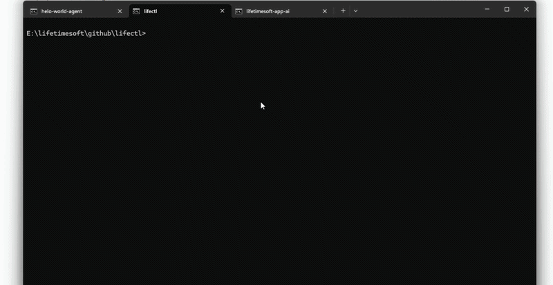

# @lifetimesoft/agent-sdk

Lightweight SDK for building portable AI agents that run on the LifetimeSoft platform.

---

## 🚀 Overview

`@lifetimesoft/agent-sdk` is a minimal runtime SDK that helps developers build **AI agents** with a consistent interface and lifecycle.

It provides:

* A standard `defineAgent()` API
* Typed `ctx` (context) object
* Abstraction for AI, storage, logging, and more
* Compatibility with `lifectl` CLI runtime

---

## 🧠 Philosophy

* **Portable** → Agent runs anywhere (local, SaaS, server)
* **Simple** → Write only business logic
* **Decoupled** → No direct dependency on SaaS APIs
* **Extensible** → Future-ready for plugins, workflows, etc.

---

## 📦 Installation

```bash
npm install @lifetimesoft/agent-sdk
```

---

## ✨ Quick Example

```ts
import { defineAgent, getEnvString } from "@lifetimesoft/agent-sdk"

export default defineAgent<{ text: string }, { reply: string }>({
  async run(ctx) {
    // Safe environment variable access
    const model = getEnvString(ctx.env, 'AI_MODEL', 'gpt-4')
    
    const reply = await ctx.ai.chat({
      messages: [{ role: "user", content: `Say hello to: ${ctx.input.text}` }],
      model,
    })

    ctx.log.info("AI reply:", reply)

    return { reply }
  },
})
```

> Running an agent built with this SDK via `lifectl`:



---

## ⚙️ Context (ctx)

The `ctx` object is injected by the runtime (via `lifectl`) and provides everything your agent needs.

### Structure

```ts
type Context = {
  input: unknown        // resolved by runtime — see Input section below

  config: {
    agent: string
    version: string
    scheduler?: SchedulerConfig
    [key: string]: unknown
  }

  env: Record<string, unknown>

  ai: {
    chat: (req: { ... }) => Promise<string>
    image: (req: { ... }) => Promise<string>
  }

  storage: {
    get: <T>(key: string) => Promise<T | null>
    set: <T>(key: string, value: T, opts?: { ttl?: number }) => Promise<void>
    delete: (key: string) => Promise<void>
  }

  queue: {
    push: <T>(data: T) => Promise<void>
  }

  log: {
    info: (...args: unknown[]) => void
    error: (...args: unknown[]) => void
    debug: (...args: unknown[]) => void
  }

  meta: {
    run_id: string
    timestamp: number
  }
}
```

---

## 📥 Input (`ctx.input`)

`ctx.input` is resolved by the runtime before `agent.run()` is called. Agent code only sees the final value — it never needs to know where the input came from.

### Input Sources

Input sources are configured via the platform Web UI (agent instance detail page). The platform stores an `input_ref` in the instance config, and the runtime resolves it automatically.

```ts
// Agent code — source-agnostic
export default defineAgent({
  async run(ctx) {
    const item = ctx.input  // already resolved, ready to use
    if (!item) return       // null = no input available (e.g. no pending dataset items)

    ctx.log.info("Got input:", item)
  }
})
```

### Dataset Input

When input source is set to a **Dataset**, the runtime atomically claims the next `pending` item on each run:

- **1 trigger / 1 scheduler tick = 1 item** — no bulk processing
- **Atomic claim** — uses `UPDATE...RETURNING` to prevent race conditions when multiple agents share the same dataset
- **Status lifecycle**: `pending` → `processing` → `completed` / `error`
- If no pending items remain, `ctx.input` is `null` and the run is skipped

```ts
export default defineAgent({
  async run(ctx) {
    const item = ctx.input as {
      id: number
      data_path: string   // R2 path: ai/dataset/{userId}/{datasetId}/{itemId}
      status: string      // "processing" when agent receives it
      created_at: string
    } | null

    if (!item) {
      ctx.log.info("No pending items")
      return
    }

    ctx.log.info("Processing item:", item.id, item.data_path)
    // ... process item ...
    // mark item completed/error via platform API when done
  }
})
```

### `InputRef` Type

```ts
export type InputRef =
    | { type: "dataset"; value: string }   // dataset id
    // future: | { type: "api"; url: string }
    // future: | { type: "file"; path: string }
```

This type is exported for platform integrations. Agent code never needs to use it directly.

---

## 🤖 AI Provider (ctx.ai)

The SDK provides a unified AI interface that supports **hybrid mode** — you can choose between Platform-side AI (using platform API keys) or Agent-side AI (using your own API keys).

### Platform-side AI (Default)

Uses API keys managed by the platform. No configuration needed in your agent.

```ts
export default defineAgent({
  async run(ctx) {
    const reply = await ctx.ai.chat({
      messages: [
        { role: "system", content: "You are a helpful assistant" },
        { role: "user", content: "Hello!" }
      ],
      model: "gemini-2.0-flash-exp",  // optional, defaults to gemini-2.0-flash-exp
      temperature: 0.7                 // optional, defaults to 0.7
    })
    
    return { reply }
  }
})
```

**Supported Models:**
- **Gemini** (default): `gemini-2.0-flash-exp`, `gemini-1.5-pro`, `gemini-1.5-flash`
- **OpenAI**: `gpt-4o-mini`, `gpt-4o`, `gpt-4-turbo`, `gpt-3.5-turbo`

The provider is auto-detected from the model name (models starting with `gpt-` use OpenAI, others use Gemini).

### `ctx.ai.image()` — Image Generation

Generate an image from a text prompt. Returns a public URL.

```ts
const imageUrl = await ctx.ai.image({
    prompt: "A serene mountain landscape at sunset",
    size: "1024x1792",   // 9:16 portrait
    image_url: referenceUrl,  // optional reference image for img2img
})
```

### `ctx.ai.video()` — Timelapse Video Generation

Generate a timelapse video from a **before/after image pair**. Returns a public URL.
Uses the same async callback pattern as `image()` — the runtime fires the request and waits for a `video_ready` WebSocket notification (timeout: 5 minutes).

```ts
const videoUrl = await ctx.ai.video({
    before_url: "https://...",   // "before" state image
    after_url:  "https://...",   // "after" state image
    prompt: "Fixed camera angle timelapse, workers constructing and decorating from image 1 to image 2",  // optional
    aspect_ratio: "9:16",        // optional, default "9:16"
    duration: 5,                 // optional, seconds, default 5
})
```

| Parameter | Type | Default | Description |
|-----------|------|---------|-------------|
| `before_url` | string | required | URL of the "before" image |
| `after_url` | string | required | URL of the "after" image |
| `prompt` | string | — | Scene/style guidance for the video |
| `aspect_ratio` | string | `"9:16"` | `"9:16"` \| `"16:9"` \| `"1:1"` |
| `duration` | number | `5` | Duration in seconds |

### Agent-side AI

Use your own API keys for full control over AI costs and model selection.

```json
// agent.json
{
  "env": {
    "gemini_api_key": "AIzaSy...",
    "ai_provider": "gemini"  // optional, auto-detected from model
  }
}
```

Or for OpenAI:

```json
{
  "env": {
    "openai_api_key": "sk-...",
    "ai_provider": "openai"  // optional
  }
}
```

**Benefits:**
- ✅ Full control over API costs
- ✅ Use any model you have access to
- ✅ Works even if platform AI is unavailable
- ✅ Direct API calls (no platform proxy)

**Trade-offs:**
- ⚠️ You manage your own API keys
- ⚠️ You pay for your own usage
- ⚠️ Keys stored in agent configuration

### Choosing Between Modes

| Feature | Platform-side | Agent-side |
|---------|--------------|------------|
| Setup | None | Add API key to env |
| Cost | Platform pays | You pay |
| Security | Keys on platform | Keys in agent config |
| Flexibility | Platform models only | Any model you have |
| Best for | Most users | Power users, custom models |

---

## 🌍 Environment Variables

Environment variables are available via `ctx.env` as `Record<string, unknown>`. 

### How Environment Variables Work

1. **Define Schema**: In `agent.json`, define env variables as an array with schema (name, type, label, description, default, required)
2. **Push to Registry**: When you push an agent, the env schema is stored in the database (`lts_app_ai_agent_versions.env`)
3. **Agent Runtime**: When agent runs, the platform loads env schema from database, applies defaults, and injects via `AGENT_CTX`
4. **User Override**: Users can override env values via Web UI, which updates the running instance
5. **No File Reading**: Agent runtime does NOT read `agent.json` or `.env` files - all env comes from the platform

### Utility Functions

Use the provided utility functions for safe type conversion:

### Utility Functions

```ts
import { 
  getEnvString, 
  getEnvInt, 
  getEnvNumber, 
  getEnvBoolean, 
  hasEnv 
} from "@lifetimesoft/agent-sdk"

export default defineAgent({
  async run(ctx) {
    // String values with defaults
    const apiKey = getEnvString(ctx.env, 'API_KEY', 'default-key')
    const host = getEnvString(ctx.env, 'HOST', 'localhost')
    
    // Integer parsing with defaults
    const port = getEnvInt(ctx.env, 'PORT', 3000)
    const timeout = getEnvInt(ctx.env, 'TIMEOUT_MS', 5000)
    
    // Boolean parsing (supports 'true', '1', 'yes', 'on' as true)
    const debugMode = getEnvBoolean(ctx.env, 'DEBUG', false)
    const enableFeature = getEnvBoolean(ctx.env, 'ENABLE_FEATURE', true)
    
    // Check if environment variable exists
    if (hasEnv(ctx.env, 'OPTIONAL_CONFIG')) {
      const value = getEnvString(ctx.env, 'OPTIONAL_CONFIG')
      ctx.log.info(`Optional config: ${value}`)
    }
  }
})
```

### Available Functions

| Function | Description | Example |
|----------|-------------|---------|
| `getEnvString(env, key, default?)` | Get string value with optional default | `getEnvString(ctx.env, 'API_KEY', 'default')` |
| `getEnvInt(env, key, default?)` | Parse as integer with optional default | `getEnvInt(ctx.env, 'PORT', 3000)` |
| `getEnvNumber(env, key, default?)` | Parse as number with optional default | `getEnvNumber(ctx.env, 'RATE', 1.5)` |
| `getEnvBoolean(env, key, default?)` | Parse as boolean (true/1/yes/on = true) | `getEnvBoolean(ctx.env, 'DEBUG', false)` |
| `hasEnv(env, key)` | Check if variable exists and is not empty | `hasEnv(ctx.env, 'OPTIONAL_VAR')` |

### Alternative: Type Assertions

For quick migration, you can use type assertions:

```ts
const port = parseInt((ctx.env.PORT as string) || '3000')
const apiKey = (ctx.env.API_KEY as string) || 'default'
```

---

## 🔧 API

### `defineAgent()`

Wrap your agent definition.
You can pass generic types for input and output: `defineAgent<TInput, TOutput>({...})`.

```ts
defineAgent({
  // Optional: schema for validating input before run() is called
  inputSchema: { /* your schema */ },

  // Optional: schema for validating agent config before run() is called
  configSchema: { /* your schema */ },

  async run(ctx) {
    // your logic here
  },
})
```

---

## 🧪 Example: Using Input + Config

```ts
import { defineAgent, getEnvString, getEnvNumber } from "@lifetimesoft/agent-sdk"

export default defineAgent({
  async run(ctx) {
    const { input, config } = ctx
    const tone = (config.tone as string) ?? "neutral"
    
    // Use environment variables safely
    const model = getEnvString(ctx.env, 'AI_MODEL', 'gpt-4')
    const temperature = getEnvNumber(ctx.env, 'AI_TEMPERATURE', 0.7)

    const reply = await ctx.ai.chat({
      messages: [
        { role: "system", content: `You reply in a ${tone} tone.` },
        { role: "user", content: (input as { text: string }).text },
      ],
      model,
      temperature,
    })

    return { text: reply }
  },
})
```

---

## 📋 agent.json

The `agent.json` file in your agent project defines metadata and default configuration:

```json
{
  "name": "my-agent",
  "version": "1.0.0",
  "description": "My awesome agent",
  "runtime": "node20",
  "main": "dist/index.js",
  "public": false,
  "input": {
    "type": "none"
  },
  "output": {
    "type": "none"
  },
  "capabilities": {
    "ai": {
      "required": true,
      "features": ["chat"]
    }
  },
  "env": [
    {
      "name": "mode",
      "type": "string",
      "label": "Operation Mode",
      "description": "Agent operation mode",
      "default": "normal",
      "required": false
    },
    {
      "name": "enable_feature",
      "type": "boolean",
      "label": "Enable Feature",
      "description": "Enable or disable the feature",
      "default": true,
      "required": false
    },
    {
      "name": "max_tasks",
      "type": "number",
      "label": "Max Tasks",
      "description": "Maximum number of tasks to process",
      "default": 10,
      "required": false
    },
    {
      "name": "api_key",
      "type": "password",
      "label": "API Key",
      "description": "API authentication key",
      "required": false
    }
  ],
  "keywords": ["example"]
}
```

### Environment Variable Schema

Each environment variable in the `env` array has the following structure:

| Field | Type | Description |
|-------|------|-------------|
| `name` | string | Variable name (use lowercase snake_case) |
| `type` | string | Data type: `"string"`, `"boolean"`, `"number"`, or `"password"` |
| `label` | string | Human-readable label for Web UI |
| `description` | string | Detailed description of the variable |
| `default` | any | Default value (optional) |
| `required` | boolean | Whether the variable is required |

### What Happens When You Push

1. `lifectl ai agent push` reads `agent.json`
2. Sends metadata to platform (including `env` field)
3. Platform stores `env` in database (`lts_app_ai_agent_versions.env`)
4. When agent runs, platform loads env from database and injects via `AGENT_CTX`

### Important Notes

- ✅ `agent.json` is read **only during push** (by lifectl)
- ✅ Default env is stored in **database**, not in agent files
- ✅ Agent runtime receives env via **`AGENT_CTX`** from platform
- ❌ Agent runtime does **NOT** read `agent.json` for env values
- ❌ Agent runtime does **NOT** read `.env` files

### Environment Variable Priority

```
agent.json env defaults (stored in database) < User overrides (via Web UI)
```

When you push an agent:
1. Platform parses the `env` array from `agent.json`
2. Extracts `default` values from each env variable definition
3. Stores the complete env schema in database (`lts_app_ai_agent_versions.env`)

When agent runs:
1. Platform loads env schema from database
2. Applies default values for each variable
3. Merges with user overrides from Web UI (user values take precedence)
4. Injects final env into agent via `AGENT_CTX`

Users can override any env value through the Web UI, which updates the running instance dynamically.

---

## 📋 Changelog

### v0.0.18 (Latest)

**🎬 Video Generation (`ctx.ai.video()`)**
- **NEW:** `ctx.ai.video()` — generate timelapse videos from a before/after image pair
- **NEW:** `prompt` parameter for scene/style guidance (e.g. construction workers, furniture staging)
- **PATTERN:** Same async callback pattern as `ctx.ai.image()` — fire-and-forget to n8n, resolved via `video_ready` WebSocket message
- **TIMEOUT:** 5 minutes (vs 2 minutes for image)
- **MOCK:** `createMockContext()` now includes a default `video` stub

### v0.0.17

**📥 Dataset Input & `InputRef` Resolution**
- **NEW:** `InputRef` type — extensible reference to external input sources (`dataset`, and more in future)
- **NEW:** Runtime automatically resolves `input_ref` → `ctx.input` before each `agent.run()` call
- **NEW:** Dataset input support — atomically claims 1 pending item per run (`UPDATE...RETURNING`)
- **BEHAVIOR:** 1 scheduler tick / 1 trigger = 1 dataset item. Skips silently if no pending items
- **DESIGN:** Agent code is source-agnostic — only sees `ctx.input`, never the `input_ref`

### v0.0.12

**📋 Environment Variable Schema Update**
- **CHANGED:** `agent.json` env field now uses array of objects format with full schema definition
- **NEW:** Each env variable includes: `name`, `type`, `label`, `description`, `default`, `required`
- **IMPROVED:** Platform can now generate UI forms automatically from env schema
- **IMPROVED:** Type validation and password field support

### v0.0.11

**🔄 Environment Variable Flow Clarification**
- **CLARIFIED:** Default env comes from database (`lts_app_ai_agent_versions.env`), not from reading `agent.json` at runtime
- **CLARIFIED:** Agent runtime receives env via `AGENT_CTX` from platform
- **CLARIFIED:** Agent runtime does NOT read `agent.json` or `.env` files for env values
- **UPDATED:** Documentation to reflect correct env flow

### v0.0.10

**🤖 AI Provider - Hybrid Mode**
- **NEW:** `ctx.ai.chat()` now fully implemented with hybrid mode support
- **Platform-side AI:** Uses platform API keys (Gemini + OpenAI)
- **Agent-side AI:** Use your own API keys via environment variables
- Auto-detects provider from model name or explicit `ai_provider` env variable
- Direct API calls to Gemini/OpenAI when using agent-side mode

### v0.0.9 (Breaking Changes)

**🔄 Environment Variables Type Change**
- **BREAKING:** Changed `ctx.env` from `Record<string, string>` to `Record<string, unknown>`
- **NEW:** Added utility functions for safe environment variable access:
  - `getEnvString()`, `getEnvInt()`, `getEnvNumber()`, `getEnvBoolean()`, `hasEnv()`
- **MIGRATION:** Use utility functions or type assertions. See [Migration Guide](MIGRATION.md)

---

## 🧪 Testing

Use `createMockContext()` from `@lifetimesoft/agent-sdk/testing` to test agents locally without the `lifectl` runtime.

```ts
import { createMockContext } from "@lifetimesoft/agent-sdk/testing"
import myAgent from "./my-agent"

const ctx = createMockContext({
  input: { text: "hello" },
  ai: {
    chat: async () => "mocked AI response",
  },
})

const result = await myAgent.run(ctx)
console.log(result)
```

The mock context also exposes inspection helpers:

```ts
// Inspect storage state after run
const store = ctx.storage._getStore()

// Inspect all messages pushed to the queue
const messages = ctx.queue._getMessages()
```

---

## 🗂️ Best Practices

### ✅ Do

* Use `ctx.ai` instead of calling external APIs directly
* Use `ctx.log` for logging
* Use environment variable utilities (`getEnvString`, `getEnvInt`, etc.) for type safety
* Keep agent logic simple and focused
* Treat `ctx` as your only runtime interface
* Use Platform-side AI for most cases (simpler, no key management)
* Use Agent-side AI when you need custom models or cost control

### 📚 Migration

* **Upgrading from v0.0.8 or earlier?** See the [Migration Guide](MIGRATION.md) for environment variable changes

---

### ❌ Don't

* Call SaaS APIs directly (`fetch(...)`)
* Implement your own heartbeat or polling
* Store sensitive logic outside `ctx.env`
* Hardcode API keys in your code (use environment variables)

---

## 🔄 Lifecycle (Handled by Runtime)

The SDK is designed to work with the `lifectl` CLI, which automatically manages:

* **WebSocket heartbeat** — persistent connection to SaaS, hibernates between messages (no polling overhead)
* **Offline detection** — immediate when connection drops, no polling delay
* **Scheduler loop** — runs `run()` on schedule, restartable without process restart
* **Config hot-reload** — when scheduler config changes in the dashboard, the runtime receives a `config_updated` message and restarts the scheduler loop automatically — no agent restart needed
* **Manual trigger** — when scheduler is `none`, the runtime listens for `trigger` messages and calls `run()` on demand
* Error handling
* Retry logic with automatic WebSocket reconnect

👉 You only implement `run(ctx)`

---

## 🕐 Scheduler

The scheduler is **fully managed by the platform** — agents never configure it directly.

The platform reads the scheduler config from the database and injects it into `ctx.config.scheduler`. The runtime then handles the loop automatically before calling `run()`.

### Scheduler Config Format

```ts
type SchedulerConfig =
  | { type: "none" }
  | { type: "interval"; value: number }   // value = milliseconds
  | { type: "cron";     value: string }   // value = cron expression (5 fields)
```

### Behavior

| type | behavior |
|---|---|
| `none` | manual trigger only — process stays alive, `run()` called each time a trigger is received |
| `interval` | wait `value` ms → run → wait `value` ms → run → ... |
| `cron` | wait until next matching tick → run → wait → run → ... |

> Both `interval` and `cron` **wait first**, then run. The agent does not run immediately on startup.

### Manual Trigger (`none`)

When scheduler is `none`, the agent process stays alive and waits for a trigger signal from the platform. Each trigger causes `run(ctx)` to be called once.

Triggers are sent from the platform dashboard (Trigger button on the instance detail page) or via the API. The agent does not need any special code to handle this — the runtime manages it automatically via the existing WebSocket connection.

```ts
export default defineAgent({
  async run(ctx) {
    // called each time a manual trigger is received
    ctx.log.info("Triggered!")
  },
})
```

The process exits cleanly on `SIGTERM` or `SIGINT`.

### Cron Expression Format

Supports both standard 5-field and extended 6-field cron expressions:

**5-field (standard):** `minute hour day-of-month month day-of-week`

```
┌─────────── minute      (0–59)
│ ┌───────── hour        (0–23)
│ │ ┌─────── day-of-month (1–31)
│ │ │ ┌───── month       (1–12)
│ │ │ │ ┌─── day-of-week  (0–6, Sunday=0)
│ │ │ │ │
* * * * *
```

**6-field (extended):** `second minute hour day-of-month month day-of-week`

```
┌───────────── second      (0–59, ignored by scheduler)
│ ┌─────────── minute      (0–59)
│ │ ┌───────── hour        (0–23)
│ │ │ ┌─────── day-of-month (1–31)
│ │ │ │ ┌───── month       (1–12)
│ │ │ │ │ ┌─── day-of-week  (0–6, Sunday=0)
│ │ │ │ │ │
* * * * * *
```

> **Note:** When using 6-field format, the seconds field is ignored by the scheduler. The agent will still run at minute-level precision.

Supports `*`, ranges (`1-5`), steps (`*/15`), and lists (`1,3,5`).

**Examples:**

```
0 9 * * 1-5      every weekday at 09:00 (5-field)
0 */5 * * * *    every 5 hours (6-field)
*/30 * * * *     every 30 minutes (5-field)
0 0 1 * *        first day of every month at midnight (5-field)
0 0 */6 * * *    every 6 hours (6-field)
```

### Agent Code

Agents don't need to do anything special — just write `run(ctx)` as normal. The runtime handles all scheduling and trigger logic automatically:

```ts
export default defineAgent({
  async run(ctx) {
    // called by scheduler (interval/cron) or manual trigger (none)
    ctx.log.info("Running...")
  },
})
```

---

## 🔮 Future Compatibility

This SDK is designed to support:

* Multi-provider AI (OpenAI, Claude, local LLM) ✅ **Implemented**
* Dataset input with atomic job queue ✅ **Implemented**
* Timelapse video generation (`ctx.ai.video()`) ✅ **Implemented**
* Workflow chaining
* Human-in-the-loop systems
* Browser automation (Playwright)
* External data sources (API, file, queue)

---

## 🧩 Related Tools

* [`lifectl`](https://www.npmjs.com/package/@lifetimesoft/lifectl) – CLI for running and managing agents
* SaaS Platform – Control plane (API, config, monitoring)

---

## 📄 License

Apache-2.0 license

---

## 🤝 Contributing

Contributions are welcome! Please open an issue or submit a PR.

---

## 💡 Final Note

> Agents built with this SDK are **portable, scalable, and future-proof**.

Build once, run anywhere 🚀
